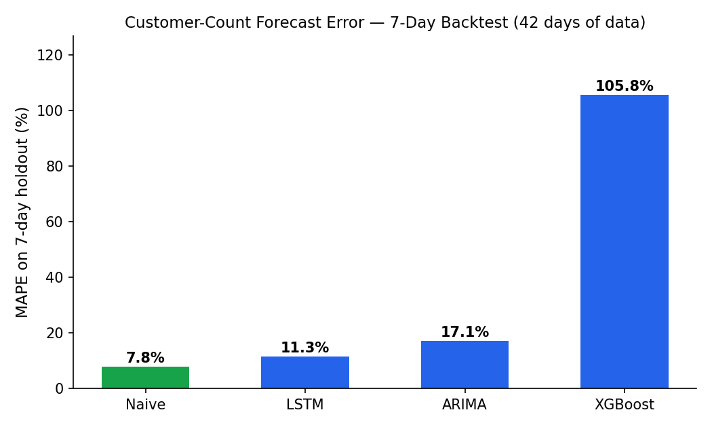

# AI-Driven Forecasting for Food Supply Chain Management

A full-stack demand forecasting system for restaurants: it ingests daily sales and footfall data, forecasts customer traffic and per-item demand using four time-series models, benchmarks those models against each other with a proper backtesting harness, and turns the forecasts into raw-material reorder suggestions — all behind a role-based (Admin/Staff) Streamlit dashboard.

Built as my Final Year Project, motivated by a simple, costly problem: restaurants either over-order (waste, spoilage) or under-order (stockouts, lost sales) because they're forecasting demand by gut feeling instead of their own historical data.

## Key Finding

Before trusting any model in production, I backtested all four against a held-out 7-day window. The result is the reason this project has a **Naive baseline built in as a first-class model, not an afterthought**:



| Model       | MAE   | RMSE  | MAPE       |
|-------------|-------|-------|------------|
| **Naive** (same day last week) | **3.29** | **3.49** | **7.8%** |
| LSTM        | 5.66  | 6.88  | 11.3% |
| ARIMA       | 6.85  | 8.84  | 17.1% |
| XGBoost     | 40.28 | 40.93 | 105.8% |

*(Customer-count series, 7-day holdout, 35 days of training history — full per-item breakdown in [`assets/backtest_results.csv`](assets/backtest_results.csv))*

With only ~6 weeks of historical data, the seasonal-naive baseline beats every "smarter" model, and XGBoost overfits badly enough to be actively harmful. This is a known failure mode in small-data time series problems, but it's rarely surfaced honestly in student projects — most just report whichever model's number looks best. Instead, this system:
- Runs the backtest automatically from the **Model Evaluation** tab so the numbers above update as more data is collected
- Defaults new restaurants to the Naive baseline until enough history accumulates for XGBoost/LSTM to reliably outperform it
- Surfaces MAE/RMSE/MAPE per model per item, so a restaurant owner (or evaluator) can see *why* a model is or isn't trusted, not just take a black-box prediction

## Features

- **Role-based auth** (Admin/Staff) with bcrypt-hashed passwords and a self-service sign-up flow
- **Bulk CSV/Excel data ingestion** with schema auto-detection, duplicate-date aggregation, future-date rejection, and Pakistani public-holiday flagging
- **Manual data entry** for daily sales and customer counts, plus on-the-fly food item creation
- **Four forecasting models** — ARIMA, XGBoost, LSTM, and a seasonal-naive baseline — sharing one interface (`(series, forecast_days) → forecast`)
- **Backtesting engine** that holds out the last *N* days, forecasts them, and scores every model with MAE/RMSE/MAPE
- **7-day customer and per-item demand forecasts**, visualized against actuals
- **Automated demand alerts** and **raw-material reorder suggestions** derived from the forecasts
- **Downloadable forecast reports** and full prediction history stored back to the database
- **Admin panel** for user/role management

## Tech Stack

| Layer | Tools |
|---|---|
| Frontend | Streamlit, Plotly |
| Modeling | XGBoost, TensorFlow/Keras (LSTM), statsmodels (ARIMA), scikit-learn |
| Data | SQLite, pandas |
| Auth | bcrypt |

## Project Structure

```
├── app.py                     # Streamlit UI: dashboard, data entry, forecasts, admin
├── database/
│   ├── init_db.py             # SQLite schema (User, Sales, CustomerCount, Prediction, ...)
│   └── scm_forecaster.db      # created on first run
├── src/
│   ├── auth/auth_manager.py   # user creation, login, role management
│   ├── data/data_manager.py   # ingestion, aggregation, queries
│   └── models/predictor.py    # ARIMA / XGBoost / LSTM / Naive + backtesting engine
├── assets/                    # evaluation chart + results (generated)
└── requirements.txt
```

## Getting Started

```bash
# 1. Create and activate a virtual environment (Python 3.10 recommended)
python -m venv my_env
my_env\Scripts\activate          # Windows
source my_env/bin/activate       # macOS/Linux

# 2. Install dependencies
pip install -r requirements.txt

# 3. Initialize the database (first run only)
python database/init_db.py

# 4. Launch the app
streamlit run app.py
```

Open `http://localhost:8501`. A default admin account is created automatically on first run (`Admin` / `Admin123` — change this before any real deployment). Staff accounts can self-register from the Sign Up tab.

## Reproducing the Backtest

```bash
python -c "
from src.models.predictor import evaluate_models
print(evaluate_models(model_types=('ARIMA','XGBoost','LSTM'), test_days=7).to_string(index=False))
"
```

## Roadmap

- [ ] Expand the training window beyond 6 weeks and re-run the backtest — the hypothesis is that XGBoost and LSTM overtake Naive once there's enough history for lag features to generalize
- [ ] Add exogenous features (weather, local events, Ramadan/Eid demand spikes) to the model inputs
- [ ] Weekly/monthly aggregated forecasts alongside the current daily horizon
- [ ] Automated email/SMS alerts for predicted stockouts

## Author

Saim Shahzad — [GitHub](https://github.com/saimshahzad-ds)
